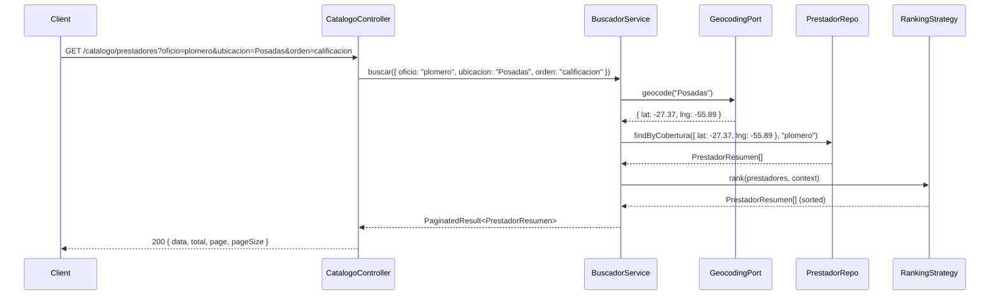

# UC04 — Buscar prestadores: Technical Design

**Status:** Draft — Pending HITL review  
**Spec:** `openspec/changes/uc04-buscar-prestadores/spec.md`  
**ADRs applied:** ADR-001 (monolito modular), ADR-002 (Port+Adapter), ADR-003 (Repository+PostgreSQL+Redis), ADR-004 (TypeScript/NestJS 11), ADR-006 (OCL → Jest assertions), ADR-007 (TypeORM)

---

## 1. Module Structure

The feature lives in a single NestJS feature module called `catalogo` (bounded context: catalog browsing and service search). It is a **read-only domain module** — it only queries existing data, never creates or mutates aggregates.

```
server/src/
├── app.module.ts                          # registers CatalogoModule
├── catalogo/
│   ├── catalogo.module.ts                 # wires providers
│   ├── catalogo.controller.ts             # HTTP facade — public routes (no JWT guard)
│   │
│   ├── application/
│   │   └── buscador.service.ts            # orchestrates search query + ranking application
│   │
│   ├── domain/
│   │   ├── prestador.entity.ts            # Provider read model (TypeORM Entity — search projection)
│   │   ├── servicio.entity.ts             # Published service entity
│   │   ├── cobertura-zona.value.ts        # Coverage-zone value object (geospatial)
│   │   ├── ranking-strategy.interface.ts  # Strategy pattern: IRankingStrategy
│   │   └── ranking/
│   │       ├── ranking-por-calificacion.strategy.ts
│   │       ├── ranking-por-distancia.strategy.ts
│   │       └── ranking-por-disponibilidad.strategy.ts
│   │
│   ├── ports/
│   │   ├── prestador-repository.port.ts   # IProviderRepository
│   │   ├── servicio-repository.port.ts    # IServiceRepository (for public profile)
│   │   └── geocoding.port.ts              # IGeocodingService (ADR-002)
│   │
│   ├── adapters/
│   │   ├── typeorm-prestador.repository.ts  # implements IProviderRepository
│   │   ├── typeorm-servicio.repository.ts   # implements IServiceRepository
│   │   └── openstreetmap-geocoding.adapter.ts  # implements IGeocodingService (nominatim)
│   │
│   └── dto/
│       ├── buscar-prestadores.dto.ts       # { oficio, ubicacion, lat?, lng?, filtros, orden }
│       ├── prestador-resumen.dto.ts        # search result item
│       └── prestador-perfil.dto.ts         # full public profile
```

---

## 2. Data Model

UC04 is read-only. It queries existing data from tables that are populated by UC01 (Registrarse — user accounts) and UC05 (Publicar servicios), and UC06 (Gestionar agenda — coverage zones).

### 2.1 PostgreSQL — `prestadores` table (search projection)

Reads from `users` (UC02 schema) plus provider-specific columns. The search-specific view can be a separate TypeORM entity mapped to a view or a query on `users` + `servicios` + `cobertura_zonas`.

| Column | Type | Source | Notes |
|--------|------|--------|-------|
| `id` | `uuid` PK | `users.id` | FK to users table |
| `nombre_completo` | `varchar(255)` NOT NULL | `users.perfil->>'nombre'` or profile table | Display name in results |
| `oficios` | `varchar[]` / JSONB | prestador's published service categories | From servicios; 1..N categories |
| `calificacion_promedio` | `decimal(2,1)` | Calculated from reseñas | 1.0–5.0 scale |
| `cantidad_resenas` | `integer` DEFAULT 0 | Count from reseñas | |
| `zona_cobertura` | `geometry(Polygon, 4326)` or `jsonb` | From UC06 config | Geospatial coverage area |
| `localidad` | `varchar(255)` | From prestador profile | Fallback when no explicit zone |

**Why geometry vs. jsonb:** If PostGIS is available in the target PostgreSQL instance, a `geometry(Polygon, 4326)` column enables native geospatial queries (`ST_Contains`, `ST_DWithin`). If PostGIS is not available, store coverage as a GeoJSON `jsonb` polygon and perform filtering in application code. For the TPI scope, we assume PostGIS is NOT required — use `jsonb` with application-level point-in-polygon or bounding-box check. (Decision D-01.)

### 2.2 PostgreSQL — `servicios` table

| Column | Type | Notes |
|--------|------|-------|
| `id` | `uuid` PK | `DEFAULT gen_random_uuid()` |
| `prestador_id` | `uuid` FK → `users.id` NOT NULL | |
| `categoria` | `varchar(100)` NOT NULL | One of the 7 catalog categories (Anexo A) |
| `descripcion` | `text` NOT NULL | |
| `rango_precio_min` | `decimal(10,2)` | Estimated price range |
| `rango_precio_max` | `decimal(10,2)` | |
| `visible` | `boolean` NOT NULL DEFAULT `true` | Soft toggle (UC05) |
| `created_at` | `timestamptz` NOT NULL DEFAULT NOW() | |
| `updated_at` | `timestamptz` NOT NULL | auto-updated |

### 2.3 PostgreSQL — `cobertura_zonas` table

| Column | Type | Notes |
|--------|------|-------|
| `id` | `uuid` PK | |
| `prestador_id` | `uuid` FK → `users.id` NOT NULL | |
| `area` | `jsonb` NOT NULL | GeoJSON Polygon or MultiPolygon |
| `localidad` | `varchar(255)` | Human-readable name |
| `created_at` | `timestamptz` NOT NULL DEFAULT NOW() | |

### 2.4 PostgreSQL — `resenas` table (queried for rating)

| Column | Type | Notes |
|--------|------|-------|
| `id` | `uuid` PK | |
| `prestador_id` | `uuid` FK → `users.id` NOT NULL | |
| `calificacion` | `smallint` NOT NULL CHECK(1..5) | |
| `contenido` | `text` | |
| `created_at` | `timestamptz` NOT NULL DEFAULT NOW() | |

---

## 3. Domain Logic

### 3.1 Search pipeline (ordered)

```
BuscadorService::buscar(criteria):
  1. Validate input → oficio and ubicacion MUST be present (ESC-07)
  2. Resolve ubicacion to coordinates via geocodingPort (if not already lat/lng)
  3. prestadores = prestadorRepo.findByCobertura(ubicacionCoords, oficio)
     → filters by category + coverage zone containment
  4. If prestadores is empty → return NO_RESULTS (ESC-05)
  5. Enrich prestadores with avg rating + review count + availability summary
  6. Apply ranking strategy (default: rating desc, then review count desc)
     If sort=distancia → rankingPorDistancia.strategy
     If sort=disponibilidad → rankingPorDisponibilidad.strategy
  7. Apply pagination (20 per page, PA-05)
  8. Return paginated results
```

### 3.2 Strategy pattern

```typescript
interface IRankingStrategy {
  rank(prestadores: PrestadorResumen[], context: RankingContext): Promise<PrestadorResumen[]>;
}

interface RankingContext {
  ubicacionCliente?: { lat: number; lng: number };
  fechaConsulta: Date;
}
```

**Concrete strategies:**

| Strategy | Behavior |
|----------|----------|
| `RankingPorCalificacion` | Sort by `calificacion_promedio` DESC, then `cantidad_resenas` DESC (RN-CAT-03) |
| `RankingPorDistancia` | Sort by Euclidean distance from `context.ubicacionCliente` to prestador's primary coverage zone center |
| `RankingPorDisponibilidad` | Sort by count of available (non-reserved) slots in next 7 days DESC (RN-CAT-04) |

### 3.3 Sequence diagram — ESC-01 (happy path)



---

## 4. Ports and Adapters

### 4.1 `IProviderRepository` — `ports/prestador-repository.port.ts`

```typescript
interface IProviderRepository {
  findByCobertura(criteria: BusquedaCriteria): Promise<PrestadorResumen[]>;
  findByIdWithProfile(id: string): Promise<PrestadorPerfil | null>;
}
```

**Adapter:** `typeorm-prestador.repository.ts` — TypeORM query with category + geometry filter.

### 4.2 `IServiceRepository` — `ports/servicio-repository.port.ts`

```typescript
interface IServiceRepository {
  findByPrestadorId(prestadorId: string): Promise<Servicio[]>;
}
```

**Adapter:** `typeorm-servicio.repository.ts` — TypeORM `Repository<Sertvicio>`.

### 4.3 `IGeocodingService` — `ports/geocoding.port.ts` (ADR-002)

```typescript
interface IGeocodingService {
  geocode(ubicacion: string): Promise<Coordenadas | null>;
  reverseGeocode(lat: number, lng: number): Promise<string | null>;
}

interface Coordenadas {
  lat: number;
  lng: number;
}
```

**Adapter:** `openstreetmap-geocoding.adapter.ts` — wraps Nominatim API. Business logic in `BuscadorService` **only calls the port interface**, never the HTTP client directly.

**Injection token:** `GEOCODING_SERVICE` (string token).

---

## 5. REST Endpoints

All routes are prefixed `/catalogo` and registered in `CatalogoController`. These are **public routes** — no JWT guard (per UC04 preconditions).

### 5.1 Endpoint table

| Method | Route | Query params | Success | Error | Scenarios |
|--------|-------|-------------|---------|-------|-----------|
| `GET` | `/catalogo/prestadores` | `oficio`, `ubicacion`, `orden`, `page`, `pageSize`, `calificacionMin?`, `fecha?` | `200 PaginatedResult` | `400`, `404` | ESC-01..05, 07, 08 |
| `GET` | `/catalogo/prestadores/:id` | — | `200 PrestadorPerfilDto` | `404` | ESC-06 |

### 5.2 HTTP status map

| Code | Meaning in UC04 | Scenario |
|------|----------------|----------|
| `200` | Search results or profile found | ESC-01..04, 06, 08 |
| `200` (empty data) | No results — returns `{ data: [], total: 0 }` | ESC-05 |
| `400` | Missing required params (oficio, ubicacion) | ESC-07 |
| `404` | Prestador ID not found | ESC-06 (invalid ID) |

### 5.3 Response shapes

**GET /catalogo/prestadores?oficio=plomero&ubicacion=Posadas&orden=calificacion — 200**
```json
{
  "data": [
    {
      "id": "uuid",
      "nombreCompleto": "Juan Pérez",
      "oficios": ["plomero", "gasista"],
      "calificacionPromedio": 4.5,
      "cantidadResenas": 12,
      "disponibilidad": "disponible_esta_semana",
      "distanciaKm": 3.2
    }
  ],
  "total": 1,
  "page": 1,
  "pageSize": 20
}
```

**GET /catalogo/prestadores?oficio=plomero&ubicacion=Posadas — 200 (empty)**
```json
{
  "data": [],
  "total": 0,
  "page": 1,
  "pageSize": 20
}
```

**GET /catalogo/prestadores/:id — 200**
```json
{
  "id": "uuid",
  "nombreCompleto": "Juan Pérez",
  "oficios": ["plomero", "gasista"],
  "calificacionPromedio": 4.5,
  "cantidadResenas": 12,
  "zonaCobertura": ["Posadas Centro", "Villa Cabello"],
  "servicios": [
    { "id": "uuid", "categoria": "plomero", "descripcion": "Reparación de cañerías", "rangoPrecio": { "min": 5000, "max": 15000 } }
  ],
  "resenas": [
    { "calificacion": 5, "contenido": "Muy buen trabajo", "fecha": "2026-06-01" }
  ]
}
```

---

## 6. OCL Contracts → Testable Assertions

### 6.1 `BuscadorService::buscar()`

**Pre-conditions:**
- `criteria.oficio` is a non-empty string matching a valid catalog category (RF-2.1)
- `criteria.ubicacion` is a non-empty string
- If `criteria.orden` is provided, it MUST be one of: `calificacion`, `distancia`, `disponibilidad`

**Post-conditions:**
- If results found:
  - Every returned `PrestadorResumen` has `calificacionPromedio` between 1.0 and 5.0
  - Every returned prestador has at least one published service in the requested category (RN-CAT-01)
  - Results are sorted according to the requested strategy (default: calificacion DESC)
  - `data.length ≤ pageSize`
- If no results:
  - Returns `{ data: [], total: 0 }` (no error — ESC-05)
- If `oficio` or `ubicacion` missing:
  - Throws `BadRequestException` with message identifying missing fields (ESC-07)

### 6.2 `BuscadorService::obtenerPerfil()`

**Pre-conditions:**
- `prestadorId` is a non-empty valid UUID

**Post-conditions:**
- If prestador exists:
  - Returns full profile with services and reviews
  - Contact info (phone, email) is NOT included (RN-CAT-05)
- If prestador not found:
  - Throws `NotFoundException`

### 6.3 Scenario → test mapping

| ESC | What is tested | Type |
|-----|---------------|------|
| ESC-01 | `buscar()` with valid oficio+ubicacion → 200 with non-empty results sorted by default | Unit + API (Supertest) |
| ESC-02 | `buscar()` with `orden=calificacion` → results sorted by rating DESC | Unit |
| ESC-03 | `buscar()` with `orden=distancia` → results sorted by proximity | Unit |
| ESC-04 | `buscar()` with `orden=disponibilidad` → results sorted by available slots | Unit |
| ESC-05 | `buscar()` with no matching providers → 200 with empty data array | Unit + API |
| ESC-06 | `obtenerPerfil()` with valid ID → 200 with full profile (no contact info) | Unit + API |
| ESC-07 | `buscar()` missing `oficio` or `ubicacion` → 400 | Unit + API |
| ESC-08 | `buscar()` with combined filters → results match ALL criteria | Unit |

---

## 7. Dependencies to Add

| Package | Env | Justification |
|---------|-----|--------------|
| `@nestjs/typeorm` | prod | NestJS module integration for TypeORM (already present from UC02) |
| `typeorm` | prod | ORM for PostgreSQL (already present) |
| `pg` | prod | PostgreSQL driver (already present) |
| `class-validator` | prod | DTO validation (`@IsNotEmpty`, `@IsOptional`, `@IsIn`) |
| `class-transformer` | prod | DTO transformation pipeline |
| `axios` | prod | HTTP client for Nominatim geocoding adapter (via port) |

No new major dependencies — UC04 reuses the existing NestJS + TypeORM + PostgreSQL stack. If PostGIS is adopted later, `postgis` extensions would be required at the DB level.

---

## 8. Security Design

### RNF-S.1 — Minimum privilege

- UC04 endpoints are **public** — no authentication required (per spec preconditions).
- Profile responses exclude contact info (phone, email, address) per RN-CAT-05.
- Search results only expose: name, offered trades, average rating, review count, coverage zone, and availability summary.

### RNF-S.4 — Ley 25.326 / privacy

- The client's search location (`ubicacion`) is NOT persisted — processed in-memory only, discarded after the request completes.
- No search history is logged at the application level. Request logs may contain the URI path but should not log query parameter values containing PII.
- If geocoding is used (string → coordinates), the request to the external geocoding service does NOT include any client-identifying information beyond the location string.

### RNF-O.1 — Performance (ATAM E1)

- Search queries must complete in ≤2 seconds at p95 under 100 concurrent requests.
- The `prestadores` query should be indexed on `(categoria, visible)` and `cobertura_zonas` on `prestador_id`.
- Availability computation should be cached with a short TTL (e.g., 30 seconds) to avoid recomputing slot counts on every search.

---

## 9. Design Decisions and HITL Checkpoints

| # | Decision | Rationale | HITL action required |
|---|----------|-----------|---------------------|
| D-01 | Coverage zone matching via application-level GeoJSON, NOT PostGIS | PostGIS adds an infrastructure dependency. For the TPI scope, a bounding-box check over GeoJSON polygons is sufficient. Can be upgraded to PostGIS later without changing the port interface. | ✅ **Resolved HITL (2026-06-13):** GeoJSON. |
| D-02 | Geocoding behind `IGeocodingService` port (ADR-002) | Wraps Nominatim (free, no API key). Swappable to Google Maps / Mapbox without touching business logic. Tests inject a fake returning fixed coordinates. | ✅ **Resolved HITL (2026-06-13):** Nominatim. |
| D-03 | Availability summarized as enum (`disponible_esta_semana`, `proxima_disponible: fecha`, `sin_disponibilidad`), NOT exact slot list in search results | PA-02 resolved: showing exact slots in search results is too expensive (requires computing availability per result). Move granular slot selection to UC07. | Confirm this summary granularity is acceptable for the client UI. |
| D-04 | Default sort: calificación DESC, then review count DESC | RN-CAT-03 — most relevant results first. The strategy pattern makes changing defaults trivial. | Already defined in spec; no action. |
| D-05 | Pagination: 20 results per page | PA-05 resolved: prevents large payloads and keeps response time under 2s (RNF-O.1 / ATAM E1). | Confirm 20/page is appropriate for mobile-first UI. |
| D-06 | `prestadores` search uses a separate read-model entity, NOT the `users` table directly | Avoids coupling search queries to the auth data model. The read model is populated/updated via events or repository synchronization. For the initial implementation, a direct query with joins is acceptable. | Monitor whether a CQRS-style read model becomes necessary as the system grows. |
