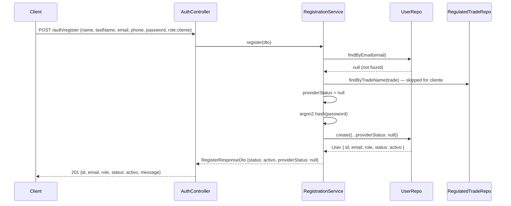
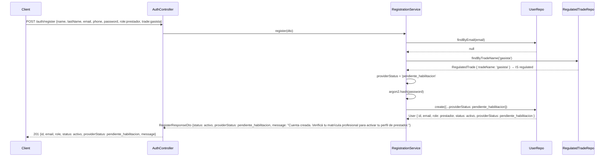

# UC01 — Registrarse: Technical Design

**Status:** Draft — Pending HITL review
**Spec:** `openspec/changes/uc01-registrarse/spec.md`
**ADRs applied:** ADR-001 (monolito modular), ADR-002 (Port+Adapter), ADR-003 (Repository+PostgreSQL+Redis), ADR-004 (TypeScript/NestJS 11), ADR-006 (OCL → Jest assertions), ADR-007 (TypeORM)

---

## 1. Module Structure

Registration lives in the existing `auth` module alongside UC02 (authentication). The `User` entity is already owned here; adding `name`, `last_name`, and `phone` columns avoids a premature module extraction. When UC03 (Gestionar perfil) is built in Iteration 2, the entity can be extracted into a shared module or a dedicated `cuentas/` module without breaking UC01/UC02.

```
server/src/auth/
├── auth.module.ts                              # registers RegistrationService; new TypeORM entities
├── auth.controller.ts                          # adds POST /auth/register route
│
├── application/
│   ├── auth.service.ts                         # unchanged — UC02 flows
│   └── registration.service.ts                 # NEW orchestrates registration flow
│
├── domain/
│   ├── user.entity.ts                          # MODIFIED — adds name, lastName, phone columns
│   ├── regulated-trade.entity.ts               # NEW — seed table for regulated trades (PA-02)
│   ├── user-role.enum.ts                       # unchanged
│   ├── user-status.enum.ts                     # unchanged
│   └── provider-status.enum.ts                 # unchanged
│
├── ports/
│   ├── user.repository.port.ts                 # MODIFIED — adds create()
│   ├── regulated-trade.repository.port.ts      # NEW — findByTradeName() for regulation check
│   ├── attempt-store.port.ts                   # unchanged
│   ├── token-store.port.ts                     # unchanged
│   └── email-notifier.port.ts                  # unchanged
│
├── adapters/
│   ├── typeorm-user.repository.ts             # MODIFIED — implements create()
│   ├── typeorm-regulated-trade.repository.ts   # NEW — queries regulated_trades table
│   ├── redis-attempt-store.ts                  # unchanged
│   ├── typeorm-token-store.ts                  # unchanged
│   └── nodemailer-email-notifier.ts            # unchanged
│
├── dto/
│   ├── register.dto.ts                         # NEW — name, lastName, email, phone, password, role, trade?
│   ├── register-response.dto.ts                # NEW — id, email, role, status, providerStatus, message
│   ├── login.dto.ts                            # unchanged
│   ├── login-response.dto.ts                   # unchanged
│   ├── forgot-password.dto.ts                  # unchanged
│   ├── reset-password.dto.ts                   # unchanged
│   └── generic-message.dto.ts                  # unchanged
│
├── guards/
│   └── jwt-auth.guard.ts                       # unchanged
│
└── strategies/
    └── jwt.strategy.ts                         # unchanged
```

**No new top-level module** — registration extends `AuthModule`. Rationale: the `User` entity lives here, argon2 is already wired, and the two use cases (UC01 + UC02) share the same bounded context (account lifecycle) until profile management (UC03) justifies extraction.

---

## 2. Data Model

### 2.1 PostgreSQL — `users` table (modified)

| Column | Type | Notes |
|--------|------|-------|
| `id` | `uuid` PK | `DEFAULT gen_random_uuid()` |
| `name` | `varchar(100)` NOT NULL | **NEW** — given name |
| `last_name` | `varchar(100)` NOT NULL | **NEW** — family name |
| `email` | `varchar(255)` UNIQUE NOT NULL | lowercased on write |
| `phone` | `varchar(30)` NOT NULL | **NEW** — E.164 or local format |
| `password_hash` | `varchar(255)` NOT NULL | Argon2id output |
| `role` | `enum('cliente','prestador','administrador')` NOT NULL | |
| `status` | `enum('activo','suspendido')` NOT NULL DEFAULT `'activo'` | Always `activo` on creation |
| `provider_status` | `enum('habilitado','pendiente_habilitacion')` NULLABLE | NULL when role ≠ prestador |
| `created_at` | `timestamptz` NOT NULL DEFAULT NOW() | |
| `updated_at` | `timestamptz` NOT NULL | auto-updated |

**Why not a separate profile table?** Name, last name, and phone are **account-level data** (required at registration, never null), queried alongside email for profile display. A separate table adds a join for every profile read with no clear benefit until UC03 introduces mutable profile fields (avatar, bio, address). When that happens, those mutable fields can go into a `profiles` table, while the immutable registration fields stay on `users`.

### 2.2 PostgreSQL — `regulated_trades` table (new)

| Column | Type | Notes |
|--------|------|-------|
| `id` | `uuid` PK | `DEFAULT gen_random_uuid()` |
| `trade_name` | `varchar(100)` UNIQUE NOT NULL | Normalized trade name, e.g. `gasista`, `electricista_matriculado` |
| `created_at` | `timestamptz` NOT NULL DEFAULT NOW() | |

**Seed data** (PA-02 — fixed list, inserted via migration or TypeORM `synchronize` seed):

| trade_name |
|------------|
| `gasista` |
| `electricista_matriculado` |
| `fumigador` |
| `instalador_alarmas_monitoreo` |
| `soldador_estructural` |
| `tecnico_calefaccion_gas` |

This table is queried only during registration to determine `providerStatus`. It is **not** the full habilitation system — UC18 will own the actual verification workflow.

---

## 3. Domain Logic

### 3.1 Registration flow (ordered steps)

```
RegistrationService::register(dto):
  1. Normalize email to lowercase
  2. userRepo.findByEmail(email)
     if exists → throw CONFLICT (409)                        [RN-REG-02, ESC-06]
  3. Validate password length >= 8 (class-validator decorator) [PA-01, ESC-05]
  4. Determine providerStatus:
     a. if role === 'cliente'                                     → null          [RN-REG-06, ESC-01]
     b. if role === 'prestador' && trade is regulated             → 'pendiente_habilitacion'  [RN-REG-05, ESC-03]
     c. if role === 'prestador' && trade is NOT regulated         → 'habilitado'             [RN-REG-06, ESC-02]
  5. passwordHash = argon2.hash(dto.password)                   [RN-REG-04]
  6. user = userRepo.create({
       name: dto.name,
       lastName: dto.lastName,
       email: normalizedEmail,
       phone: dto.phone,
       passwordHash,
       role: dto.role,
       status: 'activo',
       providerStatus,
     })
  7. logger.log(`REGISTER_SUCCESS userId=${user.id} role=${user.role}`)
  8. return RegisterResponseDto                               [ESC-01/02/03]
```

### 3.2 Validation order

```
1. DTO validation (class-validator → 422 on missing/invalid fields)  [ESC-04, ESC-05]
2. Email uniqueness check (409 on duplicate)                         [ESC-06]
3. Password strength (≥8 chars)                                      [ESC-05]
4. Determine providerStatus (no rejection, just state assignment)
5. Hash + persist
```

**Why email check before password hashing?** Hashing is expensive (~50ms). Checking uniqueness first avoids unnecessary work on a request that will be rejected anyway. This is a performance decision, not a security one — unlike login, there is no timing oracle to prevent here because the response codes differ (201 vs 409) explicitly.

### 3.3 Sequence diagrams

#### ESC-01: Successful registration as Cliente



#### ESC-03: Registration as Prestador with regulated trade



#### ESC-06: Duplicate email

```mermaid
sequenceDiagram
    participant Client
    participant AuthController
    participant RegistrationService
    participant UserRepo

    Client->>AuthController: POST /auth/register {email: existing@example.com, ...}
    AuthController->>RegistrationService: register(dto)
    RegistrationService->>UserRepo: findByEmail(email)
    UserRepo-->>RegistrationService: User { id, email, ... } → EXISTS
    RegistrationService-->>AuthController: throws ConflictException (409)
    AuthController-->>Client: 409 {message: "An account with this email already exists."}
    Note over Client,AuthController: No account is created; no data leaked (RN-REG-02)
```

---

## 4. Ports and Adapters

### 4.1 `IUserRepository` — `ports/user.repository.port.ts` (modified)

```typescript
import { User } from '../domain/user.entity.js';

export const USER_REPOSITORY = 'USER_REPOSITORY';

// Omitted: findByEmail, findById, updatePasswordHash (unchanged from UC02)

export interface IUserRepository {
  findByEmail(email: string): Promise<User | null>;
  findById(id: string): Promise<User | null>;
  updatePasswordHash(userId: string, newHash: string): Promise<void>;
  create(data: CreateUserData): Promise<User>;                          // NEW
}

export interface CreateUserData {                                       // NEW
  name: string;
  lastName: string;
  email: string;
  phone: string;
  passwordHash: string;
  role: UserRole;
  status: UserStatus;
  providerStatus: ProviderStatus | null;
}
```

**Adapter:** `typeorm-user.repository.ts` — adds `this.repo.save(data)`.

### 4.2 `IRegulatedTradeRepository` — `ports/regulated-trade.repository.port.ts` (new)

```typescript
import { RegulatedTrade } from '../domain/regulated-trade.entity.js';

export const REGULATED_TRADE_REPOSITORY = 'REGULATED_TRADE_REPOSITORY';

export interface IRegulatedTradeRepository {
  findByTradeName(tradeName: string): Promise<RegulatedTrade | null>;
}
```

**Adapter:** `typeorm-regulated-trade.repository.ts` — TypeORM `Repository<RegulatedTrade>`.
**Injection token:** `REGULATED_TRADE_REPOSITORY`.

### 4.3 Unchanged ports

`IAttemptStore`, `ITokenStore`, `IEmailNotifier` — identical to UC02 design. Registration does not use them.

---

## 5. REST Endpoints

### 5.1 Endpoint table

| Method | Route | Request body | Success | Error | Scenarios |
|--------|-------|-------------|---------|-------|-----------|
| `POST` | `/auth/register` | `RegisterDto` | `201 RegisterResponseDto` | `409`, `422` | ESC-01..06 |

Only one new endpoint. Registration is **unauthenticated** (no JWT).

### 5.2 HTTP status map

| Code | Meaning in UC01 | Scenario |
|------|-----------------|----------|
| `201` | Account created successfully | ESC-01, 02, 03 |
| `409` | Email already registered (no account created) | ESC-06 |
| `422` | Missing fields or invalid format (class-validator) | ESC-04, 05 |

### 5.3 Request / Response shapes

**POST /auth/register — RegisterDto**
```json
{
  "name": "Juan",
  "lastName": "Pérez",
  "email": "juan@example.com",
  "phone": "+543764123456",
  "password": "SecurePass1",
  "role": "cliente",
  "trade": "gasista"              // optional — only when role=prestador
}
```

**POST /auth/register — 201 RegisterResponseDto**
```json
{
  "id": "uuid",
  "email": "juan@example.com",
  "role": "cliente",
  "status": "activo",
  "providerStatus": null,
  "message": "Account created successfully."
}
```

**POST /auth/register — 201 (prestador regulated)**
```json
{
  "id": "uuid",
  "email": "carlos@example.com",
  "role": "prestador",
  "status": "activo",
  "providerStatus": "pendiente_habilitacion",
   "message": "Cuenta creada. Verificá tu matrícula profesional para activar tu perfil de prestador."
}
```

**POST /auth/register — 409**
```json
{
  "message": "An account with this email already exists.",
  "errors": ["email"]
}
```

**POST /auth/register — 422** (class-validator auto-response via NestJS `ValidationPipe`)
```json
{
  "message": "Validation failed",
  "errors": [
    { "field": "password", "constraints": { "minLength": "password must be at least 8 characters" } }
  ]
}
```

### 5.4 RegisterDto validation rules

| Field | Rules | Notes |
|-------|-------|-------|
| `name` | `@IsString()`, `@IsNotEmpty()`, `@MaxLength(100)` | |
| `lastName` | `@IsString()`, `@IsNotEmpty()`, `@MaxLength(100)` | |
| `email` | `@IsEmail()`, `@IsNotEmpty()`, `@MaxLength(255)` | |
| `phone` | `@IsString()`, `@IsNotEmpty()`, `@MaxLength(30)` | Format validation per PA — basic pattern, not strict E.164 |
| `password` | `@IsString()`, `@IsNotEmpty()`, `@MinLength(8)`, `@MaxLength(128)` | PA-01 resolved: min 8 chars |
| `role` | `@IsEnum(UserRole)`, `@IsNotEmpty()` | Only `cliente` and `prestador` accepted in controller guard |
| `trade` | `@IsOptional()`, `@IsString()`, `@MaxLength(100)` | Required when `role === 'prestador'` — validated in service |

---

## 6. OCL Contracts → Testable Assertions

### 6.1 `RegistrationService::register(dto)`

**Pre-conditions:**
- `dto` is a valid `RegisterDto` (all required fields present, formats valid)
- `dto.email` is a non-empty valid email string
- `dto.password` length ≥ 8 (PA-01)
- If `dto.role === 'prestador'`, then `dto.trade` is a non-empty string

**Post-conditions:**
- If result is `201 (RegisterResponseDto)`:
  - A `User` record exists in the database with the given `email`
  - `user.email` is lowercased
  - `user.passwordHash` is a valid Argon2id hash (starts with `$argon2id$`)
  - `user.passwordHash` is NOT equal to raw `dto.password`
  - `user.status === 'activo'`
  - If `dto.role === 'cliente'`: `user.providerStatus === null`
  - If `dto.role === 'prestador'` and `trade` is regulated: `user.providerStatus === 'pendiente_habilitacion'`
  - If `dto.role === 'prestador'` and `trade` is NOT regulated: `user.providerStatus === 'habilitado'`
  - `user.role === dto.role`
  - `user.name === dto.name`
  - `user.lastName === dto.lastName`
  - `user.phone === dto.phone`
- If result is `409 CONFLICT`:
  - NO new `User` record was created
  - The response message does NOT reveal whether the existing account is active/suspended or its role
- If result is `422`:
  - NO `User` record was created
  - Fields with errors are listed in the response

### 6.2 Scenario → test mapping

| ESC | What is tested | Type |
|-----|---------------|------|
| ESC-01 | `register()` with role cliente → 201, `providerStatus=null`, `status=activo` | Unit + API (Supertest) |
| ESC-02 | `register()` with prestador + non-regulated trade → 201, `providerStatus='habilitado'` | Unit + API |
| ESC-03 | `register()` with prestador + regulated trade → 201, `providerStatus='pendiente_habilitacion'` | Unit + API |
| ESC-04 | `register()` with missing required fields → 422, no account created | API (class-validator) |
| ESC-05 | `register()` with invalid email / short password / bad phone → 422, no account created | API |
| ESC-06 | `register()` with existing email → 409, no account created, no data leak | Unit + API |
| ESC-07 | Desistimiento after 409 → no partial data persisted | Unit (trivial — no side effects) |

---

## 7. Dependencies to Add

No new npm packages. All required dependencies are already installed from UC02:

| Package | Already installed | Used for |
|---------|-------------------|----------|
| `argon2` | ✅ (from UC02) | Password hashing (RN-REG-04) |
| `class-validator` | ✅ | DTO validation (`@IsEmail`, `@MinLength`, etc.) |
| `class-transformer` | ✅ | DTO transformation (`ValidationPipe`) |
| `typeorm` | ✅ | ORM, `Repository.save()` for create |
| `@nestjs/typeorm` | ✅ | `TypeOrmModule.forFeature()` to register new entities |
| `pg` | ✅ | PostgreSQL driver |

**New TypeORM entity registration:** `RegulatedTrade` must be added to:
1. `TypeOrmModule.forFeature([...entities])` in `AuthModule`
2. `entities: [...]` in `AppModule` `TypeOrmModule.forRoot()`

---

## 8. Security Design

### RNF-S.1 — Minimum privilege

- Registration collects only the minimum fields: name, last name, email, phone. No address, no ID document, no payment data.
- Trade/profession is collected only for prestador role.
- The response DTO does NOT include `passwordHash` or any internal state beyond what the client needs.

### RNF-S.3 — Prestador regulated trade validation

- Prestador with regulated trade is created as `providerStatus = 'pendiente_habilitacion'` immediately.
- Enforcement of access restriction is NOT done in `AuthModule` — downstream feature modules check `providerStatus` from JWT claims (same pattern as UC02 design §8 RNF-S.3).
- UC01 does not verify the license; it only sets the initial state. UC18 (Habilitación) handles the actual verification.

### RNF-S.4 — Ley 25.326 / data protection

- **No sensitive data in logs:** Logs record `userId` and event type (`REGISTER_SUCCESS`, `REGISTER_DUPLICATE_EMAIL`), never raw email, password, or phone.
- Password hashed with Argon2id before storage (RN-REG-04); raw password never stored or logged.
- 409 response does NOT reveal details about the existing account (status, role, creation date) — only that the email is taken (RN-REG-02).

### Password handling

- Same Argon2id implementation as UC02 (RN-AUTH-08 / RN-REG-04). Reuses the same `argon2` import — no new hashing strategy.
- Minimum 8 characters enforced via `@MinLength(8)` on `RegisterDto.password`.

---

## 9. Design Decisions and HITL Checkpoints

| # | Decision | Rationale | HITL action required |
|---|----------|-----------|---------------------|
| D-01 | **Extend `auth/` module** instead of creating `cuentas/` | User entity lives here; argon2 already wired; UC01+UC02 share same bounded context. Extracting to `cuentas/` is deferred to UC03 when profile management justifies it. | Confirm deferral to UC03. |
| D-02 | **`name`/`lastName`/`phone` on `users` table** instead of separate profile table | These are account-level, never-null fields. A `profiles` table can be added in UC03 for mutable fields (avatar, bio, address) without migration of registration data. | Confirm this approach for UC03 planning. |
| D-03 | **`regulated_trades` as DB seed table** instead of TypeScript enum | PA-02 resolved: fixed list. A DB table makes it queryable by UC18 for verification, and seeding via migration is standard TypeORM practice. | Confirm the seed list (see §2.2). Add more trades if discovered. |
| D-04 | **`trade` field in registration DTO, required when role=prestador** | ESC-02/03 explicitly require the prestador to declare their trade. Without this field, the system cannot determine `providerStatus`. | Confirm: trade is declared at registration time, not later in onboarding. |
| D-05 | **Separate `RegistrationService`** instead of adding to `AuthService` | Keeps SRP — `AuthService` handles authentication flows; `RegistrationService` handles account creation. Both in `auth/application/`. | None — standard separation. |
| D-06 | **201 response includes `providerStatus` and `status`** | The client needs to know whether the account is immediately operational (ESC-01/02) or pending license verification (ESC-03). Message text varies accordingly. | Confirm message copy for regulated prestador case. |
| D-07 | **No email verification** | PA-03 resolved: registration is immediate. No email confirmation step. | Already resolved HITL. |
| D-08 | **No rate limiting on registration** | PA-04 resolved: not in this iteration. Can be added later via Redis counter per IP (same pattern as UC02 attempt store). | Already resolved HITL. |
| D-09 | **Phone format validation is basic (non-empty, max length 30)** | No strict E.164 enforcement at registration. The platform operates locally in Misiones; strict format adds UX friction with no clear security benefit. | Confirm if phone format validation is needed. |
| D-10 | **`RegulatedTradeRepository` as separate port** | Follows ADR-002 pattern: small, focused interface. Even though the current implementation is a simple TypeORM query, the port keeps the domain decoupled from the ORM. | None — standard ADR-002 compliance. |

---

## 10. HITL Resolutions

| ID | Pregunta | Resolución |
|----|----------|-----------|
| PA-D01 | Trade declaration timing | ✅ **Al registrarse** — el campo `trade` es parte del DTO de registro, obligatorio si rol=prestador. |
| PA-D02 | Seed list completeness | ✅ **Completa** — cubre todos los oficios con matrícula obligatoria del Anexo A. |
| PA-D03 | Message copy for pendiente_habilitacion | ✅ **"Cuenta creada. Verificá tu matrícula profesional para activar tu perfil de prestador."** — en español. |

(End of file — total 423 lines)
